# Authentication & Authorization Architecture

## System Architecture Overview

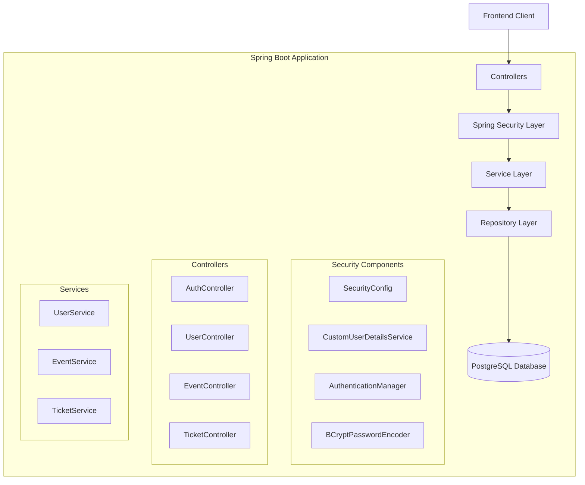

## Authentication Flow

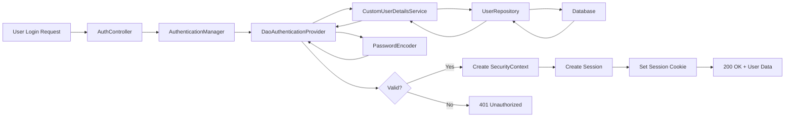

## Authorization Flow

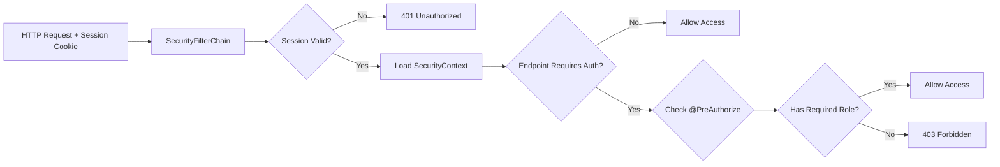

## Component Interaction Diagram

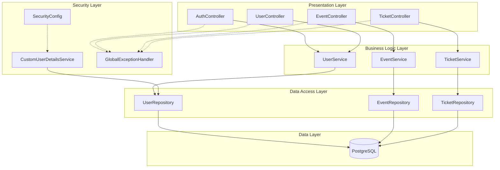

## Security Filter Chain

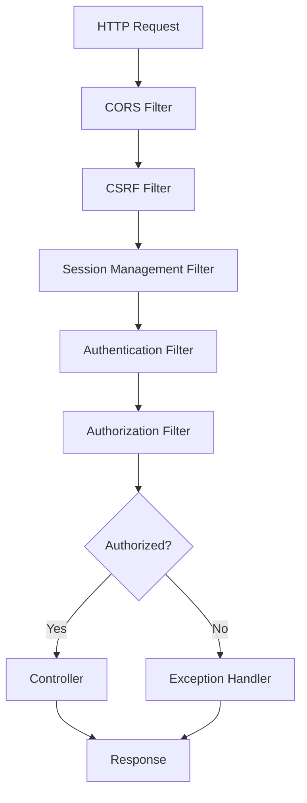

## Role-Based Access Control Matrix

| Endpoint | Public | USER | ADMIN |
|----------|--------|------|-------|
| POST /api/auth/signup | ✅ | ✅ | ✅ |
| POST /api/auth/login | ✅ | ✅ | ✅ |
| POST /api/auth/logout | ❌ | ✅ | ✅ |
| GET /api/auth/me | ❌ | ✅ | ✅ |
| GET /users/profile | ❌ | ✅ | ✅ |
| PUT /users/profile | ❌ | ✅ | ✅ |
| GET /users/{id} | ❌ | ❌ | ✅ |
| GET /events/all | ✅ | ✅ | ✅ |
| POST /events/create | ❌ | ❌ | ✅ |
| PUT /events/update/{id} | ❌ | ❌ | ✅ |
| DELETE /events/delete/{id} | ❌ | ❌ | ✅ |
| POST /tickets/book | ❌ | ✅ | ✅ |
| GET /tickets/user/{userId}/bookings | ❌ | ✅ | ✅ |
| GET /tickets/all | ❌ | ❌ | ✅ |

## Data Model

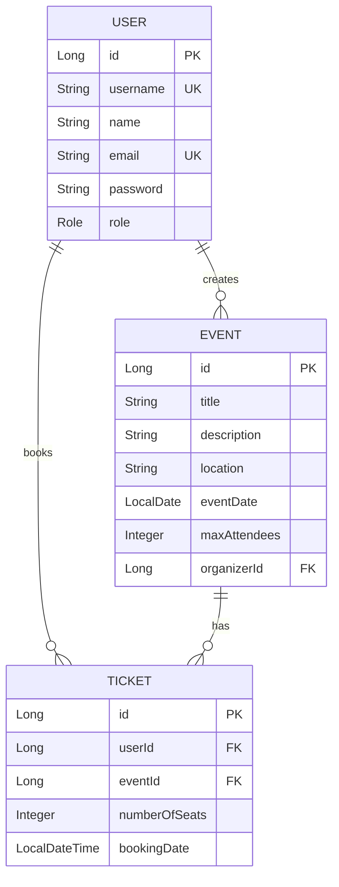

## Session Management Architecture

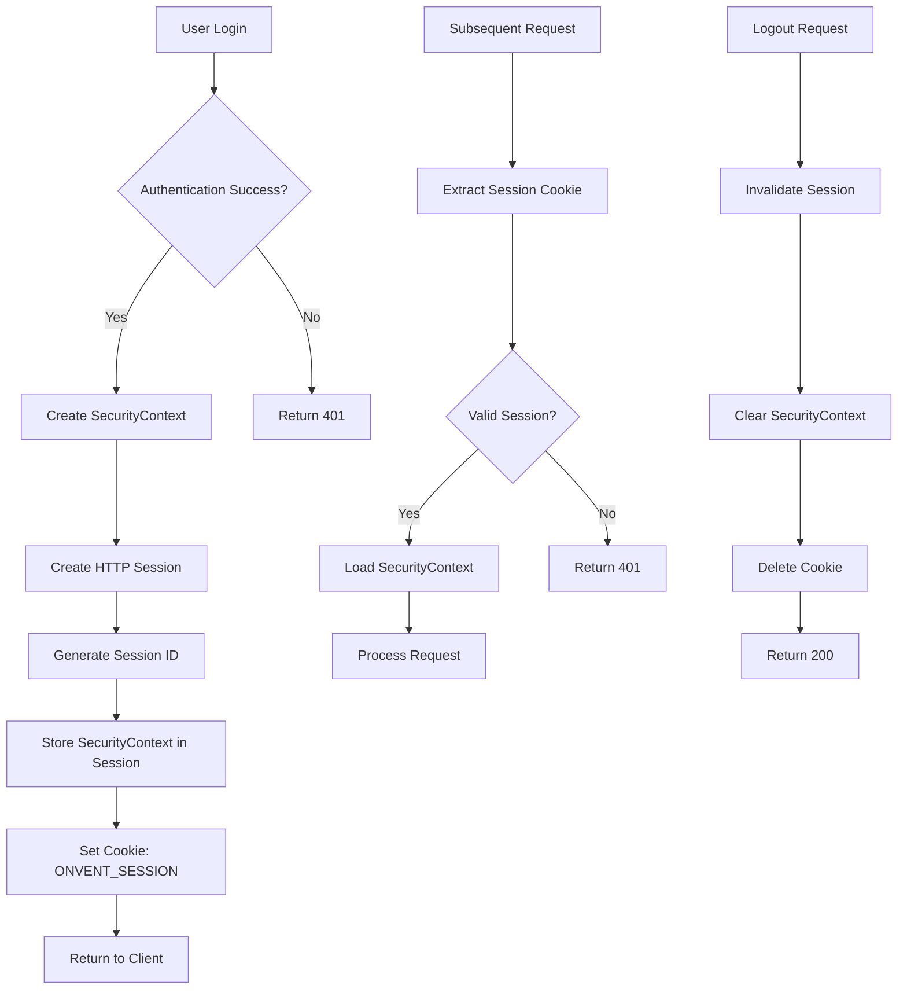

## Password Security Flow

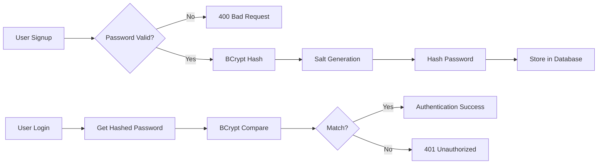

## Error Handling Architecture

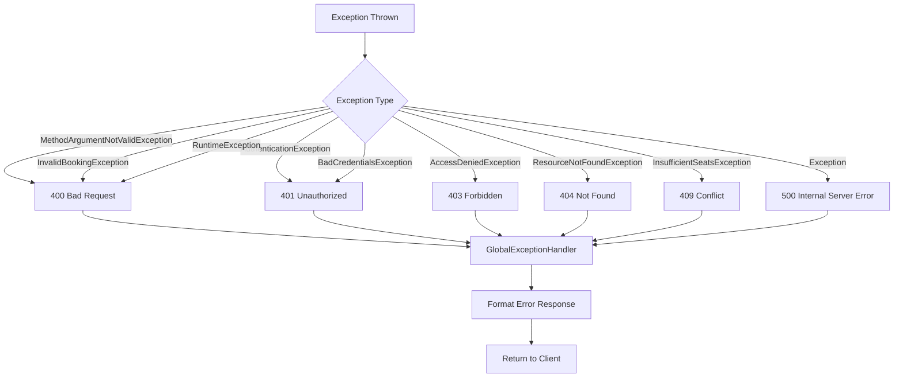

## Configuration Layers

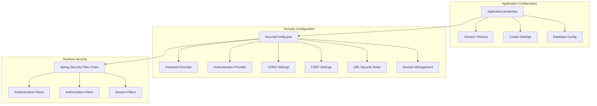

## Deployment Architecture

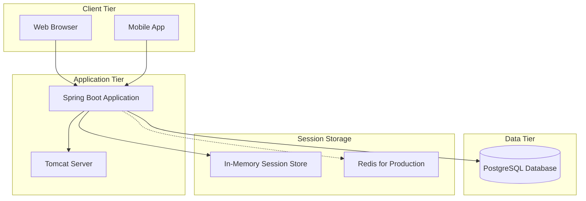

## Security Layers

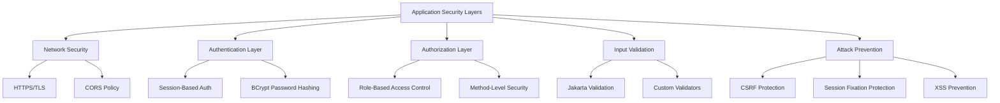

## Key Components Description

### 1. SecurityConfig
- Central security configuration
- Defines authentication and authorization rules
- Configures password encoding
- Sets up session management
- Manages CORS and CSRF

### 2. CustomUserDetailsService
- Bridges application User entity with Spring Security
- Loads user details from database
- Converts to Spring Security UserDetails
- Provides authorities based on user roles

### 3. AuthController
- Handles user registration
- Manages login/logout operations
- Provides current user endpoint
- Creates and manages sessions

### 4. UserService
- Business logic for user operations
- Password validation and encoding
- User profile management
- User lookup operations

### 5. GlobalExceptionHandler
- Centralized exception handling
- Consistent error responses
- Proper HTTP status codes
- Security-aware error messages

## Security Principles Applied

1. **Defense in Depth**: Multiple security layers
2. **Least Privilege**: Users have minimum required permissions
3. **Secure by Default**: Default role is USER, not ADMIN
4. **Fail Securely**: Errors don't expose sensitive information
5. **Complete Mediation**: Every request is checked
6. **Session Management**: Proper session lifecycle
7. **Password Security**: Strong hashing with BCrypt
8. **Input Validation**: All inputs validated
9. **CSRF Protection**: State-changing operations protected
10. **CORS Control**: Limited to trusted origins

## Performance Considerations

### Session Management
- In-memory storage for development
- Redis recommended for production
- Session timeout: 30 minutes
- Concurrent session limit: 1 per user

### Password Hashing
- BCrypt work factor: 10
- Balance between security and performance
- Consider caching user details

### Database Queries
- Indexed username and email fields
- Optimized user lookups
- Lazy loading for relationships

## Scalability Considerations

### Horizontal Scaling
- Use external session store (Redis)
- Stateless authentication alternative: JWT
- Load balancer with sticky sessions

### Session Clustering
- Share sessions across instances
- Use Spring Session with Redis
- Configure session replication

---

**This architecture provides a secure, scalable, and maintainable authentication and authorization system for the Onvent application.**
